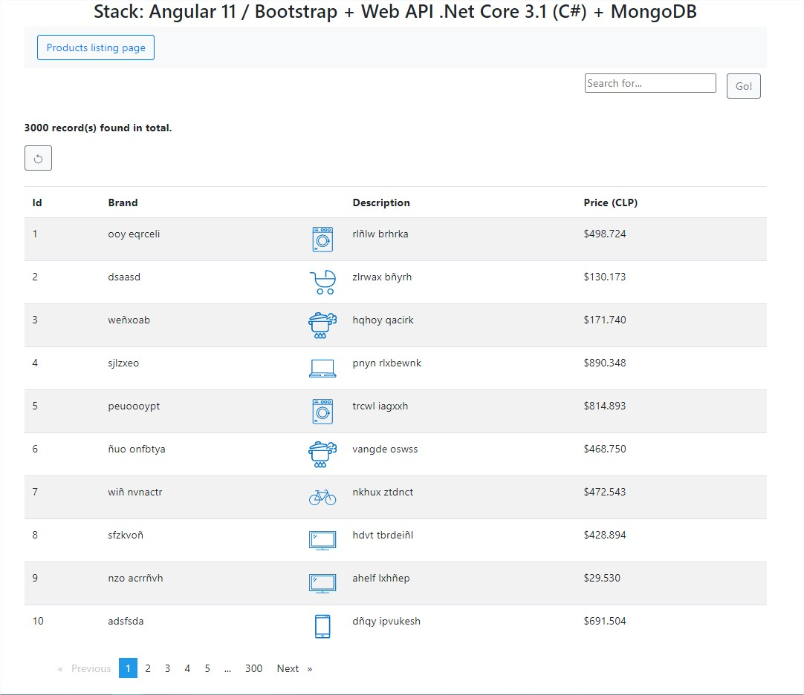

# "Reto Wallmart" technical approach proposal

**Selected stack:**
  - Angular 11 / Bootstrap 
  - API Rest .Net Core 3.1 (C#)
  - MongoDB
  
# Overview

It's requested to build a solution that presents a product search engine simulating a "promotional search" wich consider that if the search criteria is a palindrome, the price of the returned item(s) must have a 50% off.
On the other hand, if what is entered in the search box is a number, it must search directly over the product ID but if it's an alphanumeric string, and it has more than three characters it must be searched on the "Brand" and "Description" fields using any sort of "Contains" constraint.

**The resulting solutions looks like this:**

...As you can see in the folowing images, as it's requested, if a search criteria is a palindrome (in this case the search was triggered with '101' which is a palindrome), the product price must be returned with a 50% off. The price difference can be checked in the original product listing shown in the first image and the specific search result on the second image:

 

**NOTE: the prices will be upper rounded anytime the discount application doesn't give an exact value.**

# Highligths of technical solution's scheme and architecture

- First we'll have three main dockerized parts as mentioned at the beggining, deployed and running on a local machine, and they interact according the folowing image:

- Second, regarding "front" component (Angular 11 application), the simple structure of components is shown below:

- And finally, the REST API built en .NET Core 3.1 has a internal N-Layer architecture to ensure responsability separation and maintainability which follows next diagram's approach:

# Unfortunately...
There where several unknown issues and misbehaviours (such as connection refused/denied problems among many others) with docker desktop in Windows 10 Home Edition to push to Docker Hub containers images, so **for now** I'm not capable to complete the requirement part of deploying the three components of the solution on a Heroku App =/
